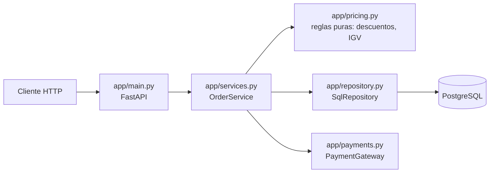

# Automatización de pruebas en DevOps: unitarias e integración

Proyecto de ejemplo para el curso de DevOps. Es una API de pedidos ("Tienda")
en Python/FastAPI + PostgreSQL. Muestra cómo diseñar, ejecutar y automatizar
**pruebas unitarias** y **pruebas de integración** en un pipeline CI
(GitHub Actions y Azure DevOps).

## 1. La pirámide de pruebas aplicada

```
            ▲  E2E / UI           (pocas, lentas, frágiles)  → fuera de alcance
           ▲▲▲ Integración        14 pruebas · ~1 s · PostgreSQL real
        ▲▲▲▲▲▲▲ Unitarias         24 pruebas · <1 s · sin red ni BD
```

| | Unitarias (`tests/unit`) | Integración (`tests/integration`) |
|---|---|---|
| Qué prueban | Reglas de negocio y orquestación aisladas | Que las piezas funcionan **juntas**: HTTP → servicio → ORM → PostgreSQL |
| Dependencias | Reemplazadas por `Mock` | Reales (solo el pago externo es simulado) |
| Velocidad | Milisegundos | Segundos |
| Si fallan, el error está en… | La función bajo prueba | La interacción: SQL, mapeo, constraints, config, contrato HTTP |
| En el pipeline | Primero, en cada commit (fail fast) | Después, solo si las unitarias pasan |

## 2. Arquitectura del ejemplo



| Módulo | Tipo de prueba | Archivo de prueba |
|---|---|---|
| `pricing.py` — subtotal, descuentos, IGV 18 % | Unitaria (parametrizada, valores límite) | `tests/unit/test_pricing.py` |
| `services.py` — registrar pedido, cobrar, rollback | Unitaria con mocks | `tests/unit/test_order_service.py` |
| `repository.py` — SQL, constraints, NUMERIC | Integración con BD real | `tests/integration/test_repository.py` |
| `main.py` — endpoints, códigos HTTP, validación | Integración end-to-end del servicio | `tests/integration/test_api.py` |

## 3. Ejecutar localmente

Requisitos: Python 3.11+, Docker.

```bash
make install            # crea .venv e instala dependencias
make lint               # ruff: estilo y errores estáticos
make test-unit          # unitarias + gate de cobertura >= 90 %
make test-integration   # levanta PostgreSQL (docker compose) + integración
make test               # todo lo anterior, igual que el pipeline
make run                # API en http://localhost:8000/docs
make db-down            # apaga y borra la BD
```

Sin `make`:

```bash
python3 -m venv .venv && source .venv/bin/activate
pip install -r requirements-dev.txt
pytest tests/unit
docker compose up -d --wait db
pytest tests/integration
```

## 4. Conceptos clave que muestra el código

**Unitarias**
- *Arrange / Act / Assert* explícito (`test_pricing.py`).
- `@pytest.mark.parametrize`: un caso de prueba, muchos datos; incluye
  **valores límite** (499.99 vs 500.00 para el descuento por volumen).
- **Dobles de prueba**: `Mock` para el repositorio y la pasarela; se verifica
  el *comportamiento* (`assert_called_once`, `assert_not_called`), no solo
  el valor de retorno. Ej.: "si el pago falla, se hace rollback y no se guarda".
- **Inyección de dependencias** en `OrderService`: es lo que hace al código
  testeable.

**Integración**
- **Base de datos real y efímera** (contenedor), nunca compartida.
- **Aislamiento por transacción**: cada prueba corre en una transacción que
  se revierte al final (`tests/integration/conftest.py`). No hay que limpiar
  tablas y las pruebas son independientes del orden.
- `dependency_overrides` de FastAPI para inyectar la sesión de prueba y un
  *fake* de la pasarela de pagos (sistema externo que no controlamos).
- Prueban lo que un mock **no puede** garantizar: constraint `UNIQUE`,
  `UPDATE ... WHERE stock >= n` atómico, precisión de `NUMERIC`, códigos HTTP.
- Si la BD no está disponible, la prueba **falla** con un mensaje claro;
  nunca se omite en silencio (un `skip` silencioso en CI es un falso verde).

**Pipeline (CI)**
- `lint → unit (matriz 3.11/3.12/3.13) → integration`: fail fast, la etapa
  cara solo corre si la barata pasó.
- **Quality gates**: el build falla si la cobertura baja de 90 % (dominio) u
  80 % (integración).
- Reportes **JUnit XML** y **Cobertura XML** publicados como artefactos
  (GitHub) o en la pestaña *Tests / Code Coverage* (Azure DevOps).
- PostgreSQL como *service container* (GitHub) o vía `docker compose`
  (Azure DevOps): mismo `docker-compose.yml` local y en CI.

Archivos: [`.github/workflows/ci.yml`](.github/workflows/ci.yml) ·
[`azure-pipelines.yml`](azure-pipelines.yml)

## 5. Laboratorio

Ejercicios para los alumnos en [`docs/laboratorio.md`](docs/laboratorio.md).
