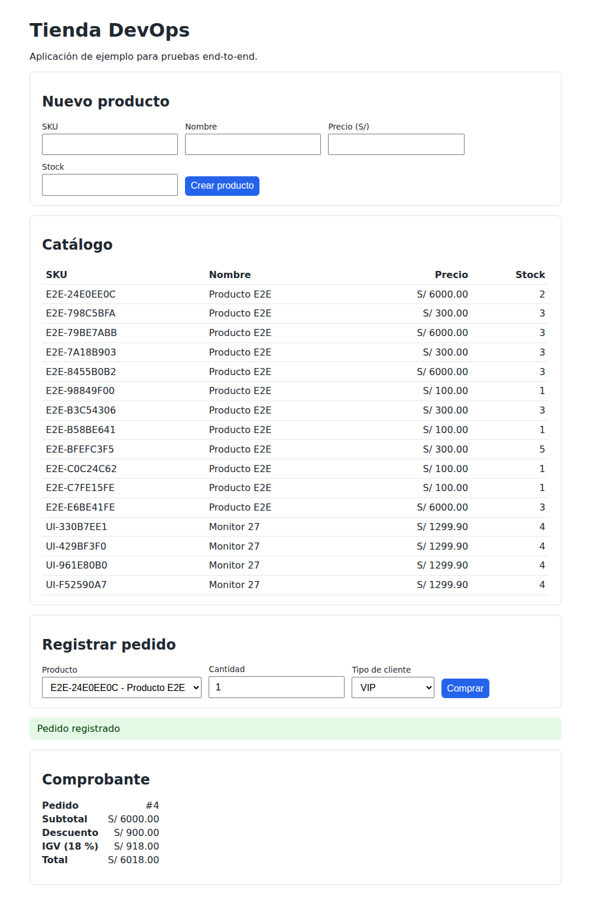
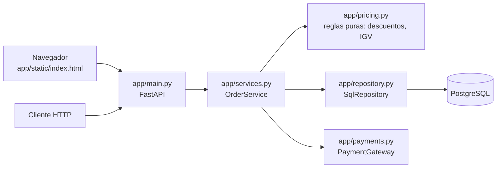

# Automatización de pruebas en DevOps: unitarias, integración, API y E2E

Proyecto de ejemplo para el curso de DevOps. Es una tienda de pedidos en
Python/FastAPI + PostgreSQL con una UI web mínima. Muestra cómo diseñar,
ejecutar y automatizar **pruebas unitarias**, **de integración**,
**de API con Karate** y **end-to-end (E2E)** en un pipeline CI (GitHub Actions y Azure DevOps).

## 1. La pirámide de pruebas aplicada

```
              ▲    E2E (UI)       13 pruebas  · Playwright · navegador real
            ▲▲▲▲   API (Karate)   18 escenarios · caja negra · app desplegada
          ▲▲▲▲▲▲   Integración    15 pruebas · ~1 s · PostgreSQL real
        ▲▲▲▲▲▲▲▲ Unitarias       24 pruebas · <1 s · sin red ni BD
```

| | Unitarias (`tests/unit`) | Integración (`tests/integration`) | E2E (`tests/e2e`) |
|---|---|---|---|
| Qué prueban | Reglas de negocio y orquestación aisladas | Que las piezas funcionan **juntas**: HTTP → servicio → ORM → PostgreSQL | **Flujos de usuario** en el navegador contra la app **desplegada** |
| Cómo ven la app | Importan funciones | Importan la app (`TestClient`) | Caja negra: solo una URL |
| Dependencias | Reemplazadas por `Mock` | Reales (solo el pago es simulado) | Todo real: contenedor, red, BD, navegador |
| Datos | En memoria | Transacción con rollback por prueba | BD compartida: cada prueba crea datos únicos |
| Velocidad | Milisegundos | Segundos | Segundos + build y despliegue |
| Si fallan, el error está en… | La función bajo prueba | SQL, mapeo, constraints, contrato HTTP | UI, JavaScript, empaquetado (Dockerfile), configuración, red |
| En el pipeline | Primero (fail fast) | Si pasan las unitarias | Al final, si pasa integración |

## 2. Arquitectura del ejemplo





| Módulo | Tipo de prueba | Archivo de prueba |
|---|---|---|
| `pricing.py` — subtotal, descuentos, IGV 18 % | Unitaria (parametrizada, valores límite) | `tests/unit/test_pricing.py` |
| `services.py` — registrar pedido, cobrar, rollback | Unitaria con mocks | `tests/unit/test_order_service.py` |
| `repository.py` — SQL, constraints, NUMERIC | Integración con BD real | `tests/integration/test_repository.py` |
| `main.py` — endpoints, códigos HTTP, validación | Integración del servicio vía HTTP | `tests/integration/test_api.py` |
| API desplegada — contrato, esquema, reglas de negocio por HTTP | API con Karate (BDD) | `tests/karate/src/test/java/tienda/*.feature` |
| UI + contenedor + BD — catálogo (alta, consulta) y compra (descuentos, errores) | E2E con Playwright, agrupadas por feature | `tests/e2e/catalogo/`, `tests/e2e/compra/` |

## 3. Ejecutar localmente

Requisitos: Python 3.11+, Docker.

```bash
make install            # crea .venv, instala dependencias y Chromium
make lint               # ruff: estilo y errores estáticos
make test-unit          # unitarias + gate de cobertura >= 90 %
make test-integration   # levanta PostgreSQL (docker compose) + integración
make test-api           # despliegue + pruebas de API con Karate (requiere Java 17+ y Maven)
make test-e2e           # build + despliegue de la app (docker compose) + Playwright
make test               # todo lo anterior, igual que el pipeline
make app-up             # app desplegada en http://localhost:8000 (UI) y /docs (API)
make down               # apaga todo y borra la BD
```

Para ver el navegador mientras corren las E2E: `pytest tests/e2e --headed --slowmo 500`.
Si una E2E falla, abre el trace con
`playwright show-trace reports/e2e-artifacts/<prueba>/trace.zip`.

> Si ya tenías el volumen de PostgreSQL de una versión anterior, corre
> `make down` una vez para que se cree la BD `tienda_test`.

Sin `make`:

```bash
python3 -m venv .venv && source .venv/bin/activate
pip install -r requirements-dev.txt
pytest tests/unit
docker compose up -d --wait db
pytest tests/integration
```

## 4. Conceptos clave que muestra el código

**Unitarias**
- *Arrange / Act / Assert* explícito (`test_pricing.py`).
- `@pytest.mark.parametrize`: un caso de prueba, muchos datos; incluye
  **valores límite** (499.99 vs 500.00 para el descuento por volumen).
- **Dobles de prueba**: `Mock` para el repositorio y la pasarela; se verifica
  el *comportamiento* (`assert_called_once`, `assert_not_called`), no solo
  el valor de retorno. Ej.: "si el pago falla, se hace rollback y no se guarda".
- **Inyección de dependencias** en `OrderService`: es lo que hace al código
  testeable.

**Integración**
- **Base de datos real y efímera** (contenedor), nunca compartida.
- **Aislamiento por transacción**: cada prueba corre en una transacción que
  se revierte al final (`tests/integration/conftest.py`). No hay que limpiar
  tablas y las pruebas son independientes del orden.
- `dependency_overrides` de FastAPI para inyectar la sesión de prueba y un
  *fake* de la pasarela de pagos (sistema externo que no controlamos).
- Prueban lo que un mock **no puede** garantizar: constraint `UNIQUE`,
  `UPDATE ... WHERE stock >= n` atómico, precisión de `NUMERIC`, códigos HTTP.
- Si la BD no está disponible, la prueba **falla** con un mensaje claro;
  nunca se omite en silencio (un `skip` silencioso en CI es un falso verde).

**API con Karate** (`tests/karate`)
- ¿Por qué no está en "integración"? Las pruebas de integración en `pytest`
  importan la app y controlan la BD (rollback). Karate es **caja negra**: solo
  conoce la URL. Prueba el **contrato** de la API desplegada, la misma que
  consumiría un frontend, una app móvil u otro microservicio.
- Sintaxis Gherkin (`Given / When / Then`) legible por QA y negocio, sin
  escribir Java: el único `.java` es el runner de JUnit.
- `match` con marcadores *fuzzy* (`#number`, `#regex`, `#string`) para validar
  **esquemas** sin acoplarse a valores variables como `id` o `payment_id`.
- `Scenario Outline` + `Examples`: la tabla de reglas de precio (descuentos,
  IGV) es la misma tabla que negocio entiende.
- `call read('common/crear-producto.feature')`: pasos reutilizables.
- Ejecución en paralelo (`Runner.parallel(4)`) y reporte HTML en
  `tests/karate/target/karate-reports/karate-summary.html`.
- Otra URL (staging, por ejemplo): `mvn test -Dkarate.baseUrl=https://staging.midominio.pe`.

| Usa `pytest` (integración) si… | Usa Karate si… |
|---|---|
| El equipo es del mismo lenguaje que la app | QA o varios equipos prueban la API sin tocar su código |
| Necesitas aislar la BD o simular dependencias | Quieres probar el contrato de un servicio ya desplegado |
| Buscas el feedback más rápido | Buscas reutilizar la suite contra varios ambientes (dev, QA, staging) |

**E2E**
- La app se construye con el `Dockerfile` y se despliega con `docker compose`:
  se prueba **el mismo artefacto** que iría a producción.
- Caja negra: las pruebas no importan nada de `app/`, solo conocen la URL
  (`E2E_BASE_URL`, por defecto `http://localhost:8000`).
- Selectores por rol, etiqueta o `data-testid` (`get_by_role`,
  `get_by_label`), acotados a su sección para evitar ambigüedad
  (*strict mode* de Playwright).
- `expect(...)` espera automáticamente: nunca `sleep`.
- Datos preparados por API (rápido) y acción por UI (lo que se prueba).
- La BD **no** se limpia entre pruebas, como en staging: cada prueba usa
  SKUs únicos para ser independiente.
- **Agrupación por feature**: una carpeta por feature (`catalogo/`, `compra/`),
  un archivo por capacidad (`test_alta_producto.py`, `test_descuentos.py`) y
  clases para agrupar escenarios (`TestCompraExitosa`, `TestCompraRechazada`).
  Cada módulo lleva el marker de su feature, así se puede correr solo uno:

  ```bash
  pytest tests/e2e -m catalogo            # por marker
  pytest tests/e2e/compra                 # por carpeta
  pytest tests/e2e -k "TestCompraRechazada"  # por clase
  make test-e2e FEATURE=compra            # despliega y corre un feature
  ```

  En el pipeline E2E también se elige el feature al ejecutarlo a mano:
  *Actions → E2E Tests → Run workflow → feature* (GitHub) o el parámetro
  `feature` en *Run pipeline* (Azure DevOps). Valores: `todos`, `catalogo`,
  `compra`. En PR, push y la corrida diaria se prueban todos.
- **Scope de fixtures**: cuánto vive un dato y con quién se comparte.

  | Scope | Fixture | Se crea… | Úsalo cuando… |
  |---|---|---|---|
  | `session` | `base_url`, `api`, `browser` (`conftest.py`) | 1 vez por ejecución | Es caro y no tiene estado: conexión, navegador |
  | `package` | — | 1 vez por carpeta | Datos comunes a todo un feature |
  | `module` | `producto` (`catalogo/test_consulta_catalogo.py`) | 1 vez por archivo | Las pruebas solo **leen** el dato |
  | `class` | `producto` (`compra/test_descuentos.py`) | 1 vez por clase | Comparten el dato pero no verifican lo que cambian (stock) |
  | `function` | `create_product`, `page` | En cada prueba | La prueba modifica el estado y lo verifica |

  Para verlo en vivo: `pytest tests/e2e --setup-show` marca cada fixture con
  `S`, `P`, `M`, `C` o `F` al crearla y destruirla. Regla: el scope más
  amplio que no haga a las pruebas dependientes del orden.
- Evidencia en fallos: trace de Playwright, captura de pantalla y logs del
  contenedor como artefactos del pipeline.
- Integración usa la BD `tienda_test` y la app desplegada usa `tienda`, así
  ambos niveles pueden correr sobre el mismo PostgreSQL sin pisarse.

**Pipelines: tres, independientes**

| Pipeline | GitHub Actions | Azure DevOps | Qué valida | Cuándo corre |
|---|---|---|---|---|
| CI | [`ci.yml`](.github/workflows/ci.yml) | [`ci.yml`](azure-pipelines/ci.yml) | `lint → unit (3.11/3.12/3.13) → integración` | Todo PR y push a `main` |
| API (Karate) | [`api-tests-karate.yml`](.github/workflows/api-tests-karate.yml) | [`api-tests-karate.yml`](azure-pipelines/api-tests-karate.yml) | Contrato de la API desplegada | PR/push que toquen `app/`, `tests/karate/` o el despliegue; manual; diario |
| E2E (Playwright) | [`e2e-tests.yml`](.github/workflows/e2e-tests.yml) | [`e2e-tests.yml`](azure-pipelines/e2e-tests.yml) | Flujos de usuario en el navegador | PR/push que toquen `app/`, `tests/e2e/` o el despliegue; manual; diario |

- **Por qué separarlos**: CI es rápido y corre siempre; es el feedback del
  desarrollador. Karate y E2E necesitan un ambiente desplegado, son más
  lentos y tienen otro ciclo de vida: también se corren contra QA o staging
  sin recompilar nada, y como regresión nocturna.
- **Ejecución manual contra otro ambiente**: en GitHub, *Actions → API Tests
  (Karate) / E2E Tests → Run workflow* e indicar `base_url`. En Azure
  DevOps, *Run pipeline* y cambiar el parámetro `baseUrl` (valor `local` =
  desplegar en el agente). Si se indica una URL, no se despliega nada.
- **Filtros de rutas**: un cambio solo en `docs/` no dispara Karate ni E2E;
  ahorra minutos de runner.
- **Trade-off aceptado**: los tres corren en paralelo en un PR, así que Karate
  y E2E pueden ejecutarse aunque CI falle. Encadenarlos (`workflow_run` en
  GitHub, `resources.pipelines` en Azure) ahorra minutos, pero el resultado ya
  no aparece como check del PR.
- **Quality gates**: el build falla si la cobertura baja de 90 % (dominio) u
  80 % (integración).
- Reportes **JUnit XML**, **Cobertura XML**, HTML de Karate y traces de
  Playwright como artefactos (GitHub) o en *Tests / Code Coverage* (Azure).
- Mismo `docker-compose.yml` para desplegar en local, en GitHub y en Azure.

> En Azure DevOps cada archivo de `azure-pipelines/` se registra como un
> pipeline distinto: *Pipelines → New pipeline → Existing Azure Pipelines
> YAML file*.

## 5. Laboratorio

Ejercicios para los alumnos en [`docs/laboratorio.md`](docs/laboratorio.md).
